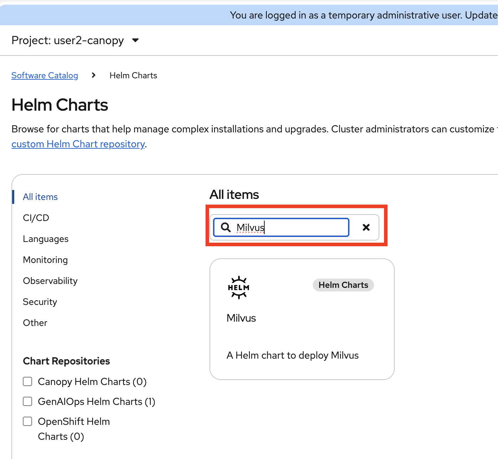
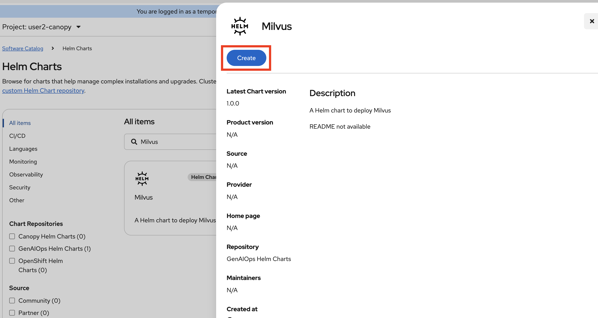
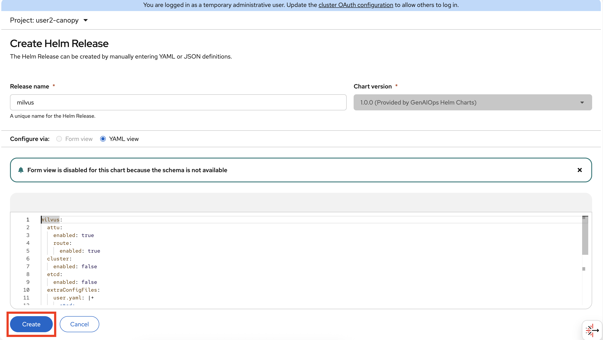
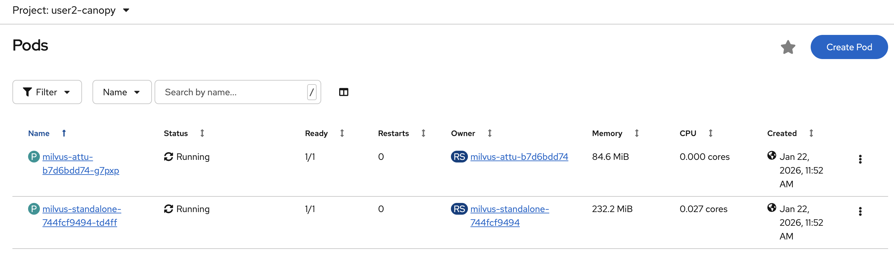
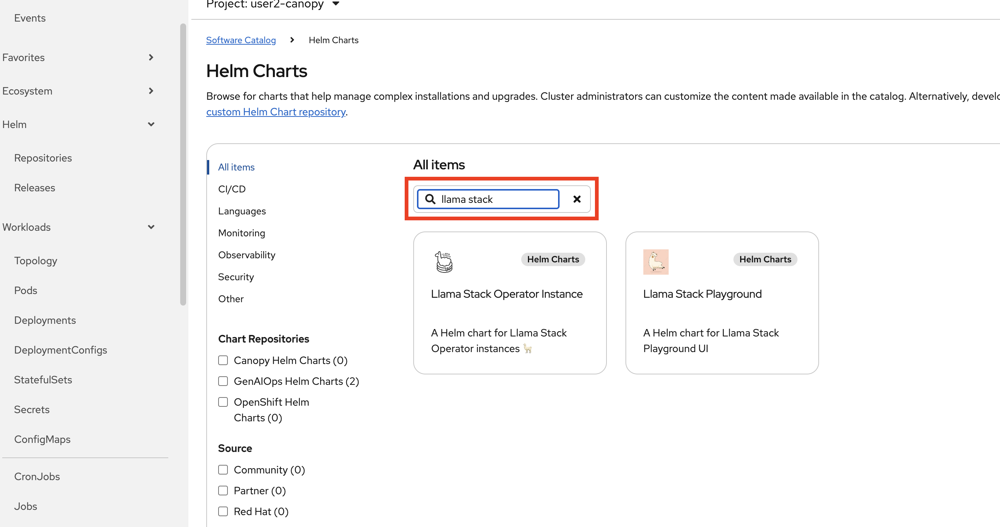
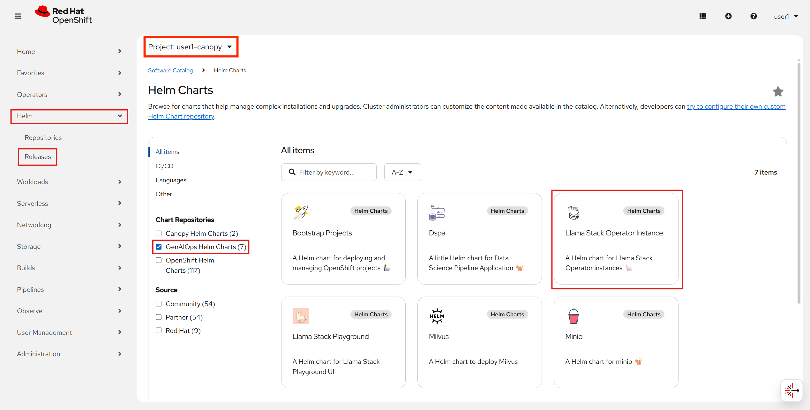
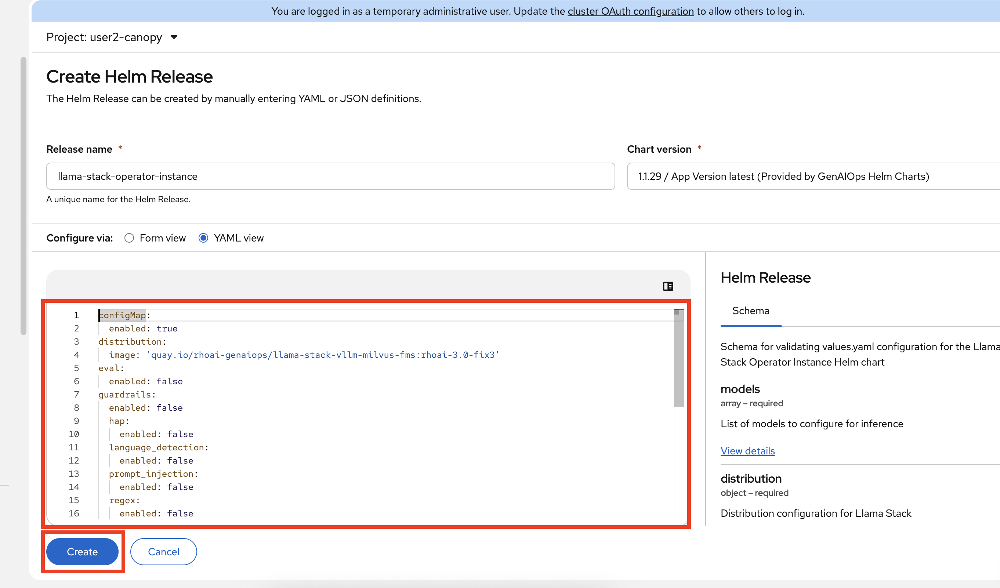

# Set up deployments

Because we have to skip some of the AI501 sections, we will need to take some shortcuts and will need to set up our namespace.

## Set up Milvus

Milvus is a high-performance, open-source vector database developed by Zilliz. We'll be using it as a RAG database.

1. Let's quickly deploy a Milvus database instance into our namespace. In the Openshift console, expand `Helm` section from the left menu (if it is not there, refresh the page), click `Releases` and make sure you are on `<USER_NAME>-canopy` project. Then from the top right select `Create Helm Release`.

    

2. In the search bar, search for `Milvus` and choose the `Milvus` instance tile.

    {width=80%}

    and then press the blue `Create` button.  

    {width=80%}

3. This brings up another configuration screen. We can leave the defaults for this Milvus instance and press the `Create` button to bring up the Milvus script.

    

4. Go to the `Pods` tab under `Workloads` and wait for the 2 Milvus pods to be ready. Once they are in the ready state we can move on to the next step.

    

5. We have successfully brought up a Milvus database for RAG. 

## Deploy Llama Stack

1. Let's quickly deploy llama stack to our namespace. In Openshift console, again expand `Helm` section from the left menu, click `Releases` and make sure you are on `<USER_NAME>-canopy` project. Then from the top right select `Create Helm Release`. 

    

2. Select `GenAIOps Helm Charts` from the Chart Repositories list and choose `Llama Stack Operator Instance`

    

3. We need to update the configuration of llama stack:

    

```yaml
configMap:
  enabled: true
distribution:
  image: 'quay.io/rhoai-genaiops/llama-stack-vllm-milvus-fms:rhoai-3.0-fix3'
eval:
  enabled: true
guardrails:
  enabled: false
  hap:
    enabled: false
  language_detection:
    enabled: false
  prompt_injection:
    enabled: false
  regex:
    enabled: false
    filter:
      - (?i).*fight club.*
mcp:
  enabled: true
mcp_aihub:
  enabled: false
models:
  - name: llama32
    url: 'http://llama-32-predictor.ai501.svc.cluster.local:8080/v1'
otelCollector:
  enabled: true
rag:
  enabled: true
  milvus:
    service: milvus
telemetry:
  enabled: true

```


..and click `Create`.

We are updating `eval: enabled: true`, `mcp: enabled: true`, `rag: enabled: true`, and updating `rag: milvus: service: milvus`

## Let's start using these components
1. After Milvus and Llama stack is up and running, we'll need to set up the Milvus database for using it with RAG.

2. Open up the notebook called `5-rag/2-intro-to-RAG.ipynb` and follow the instructions.

3. Once you're done with "Intro to RAG" we can move onto the next section.
