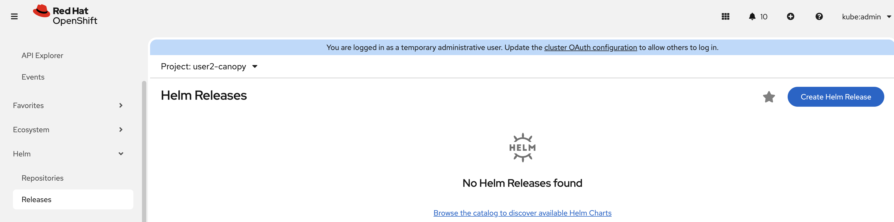
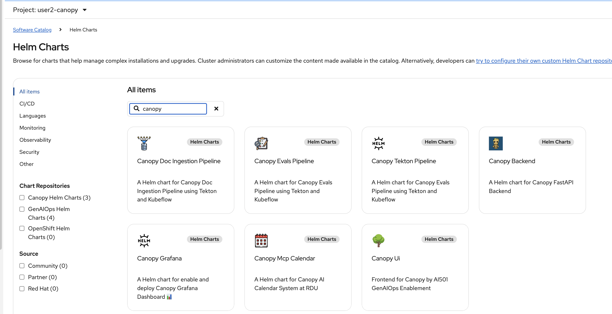
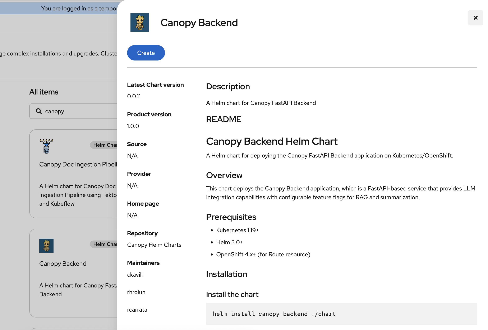
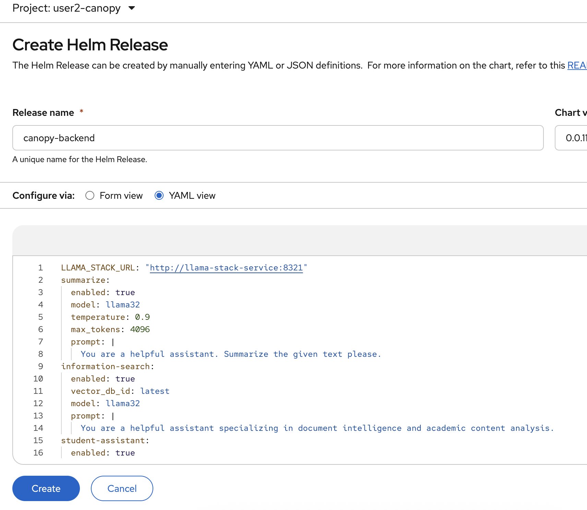
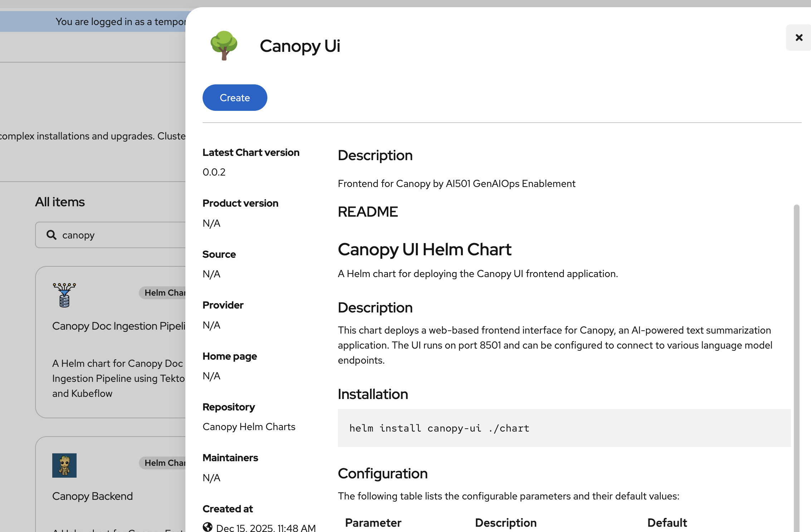
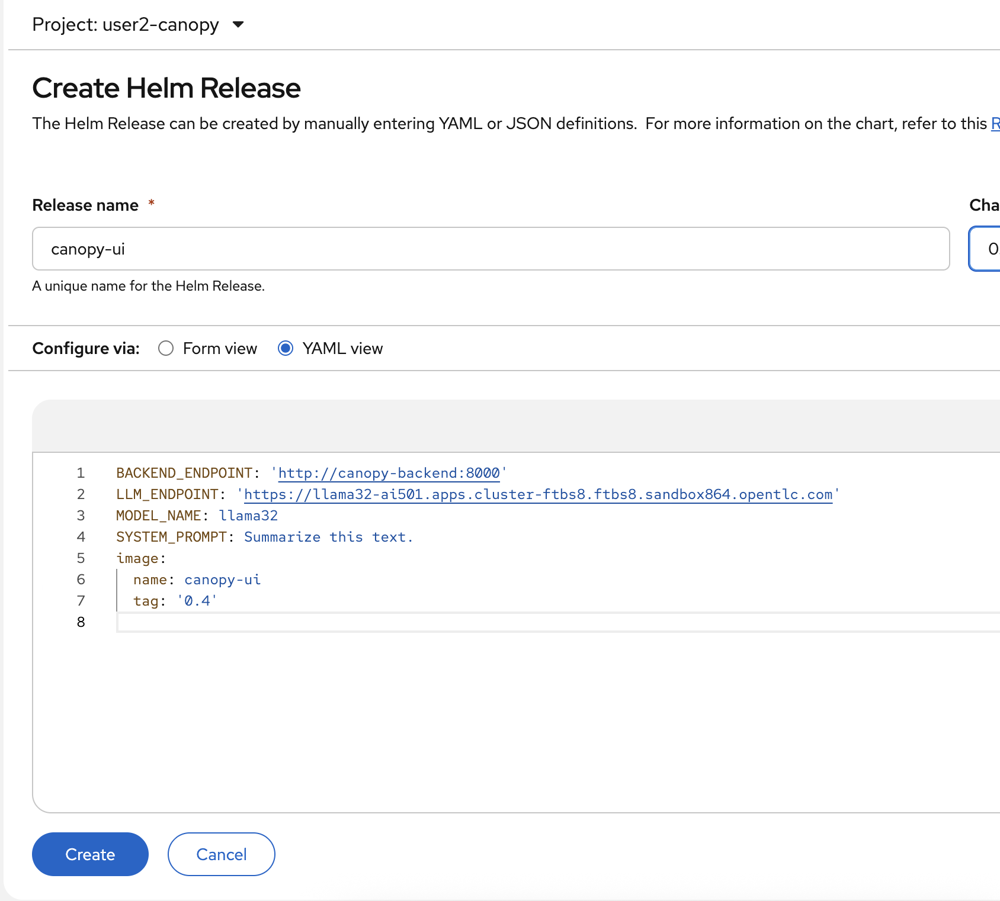

# Set up Canopy so we can use Agents

## Deploy the Canopy Backend

1. We'll first need to set up Canopy Backend.

2. Let's deploy the Canopy Backend instance into our namespace. In the Openshift console, expand `Helm` section from the left menu (if it is not there, refresh the page), click `Releases` and make sure you are on `<USER_NAME>-canopy` project. Then from the top right select `Create Helm Release`.

    

2. In the search bar, search for `Canopy` and choose the `Canopy Backend` instance tile and press the blue `Create` button.

    
    

3. This brings up another configuration screen. 

    

4. Edit the config

    ```yaml
    LLAMA_STACK_URL: "http://llama-stack-service:8321"
    summarize:
      enabled: true
      model: llama32
      temperature: 0.9
      max_tokens: 4096
      prompt: |
        You are a helpful assistant. Summarize the given text please.
    information-search:
      enabled: true
      vector_db_id: latest
      model: llama32
      prompt: |
        You are a helpful assistant specializing in document intelligence and academic content analysis.
    student-assistant: 
      enabled: true
      model: llama32
      temperature: 0.1
      vector_db_id: latest
      mcp_calendar_url: "http://canopy-mcp-calendar-mcp-server:8080/sse"
      prompt: |
        You are a helpful assistant that helps students with their calendar and studies.
        Today is {datetime.today().strftime('%Y-%m-%d')}.

        Your workflow:

        1. If student asks about their schedule ("What lectures do I have?"):
          - Call get_upcoming_events
          - Show them the results
          - DONE (don't modify anything)

        2. If student asks a question about a topic ("I need help understanding X"):
          - First: call search_knowledge_base with the topic
          - If knowledge base has relevant information: answer their question with that information, DONE
          - If knowledge base has NO relevant information:
            a) Call find_professors_by_expertise to find an expert
            b) Call get_events_by_date to check for scheduling conflicts
            c) Call create_event to schedule a meeting with the professor at a free time
            d) Tell the student you scheduled the meeting

        When scheduling with create_event:
        - Pick a reasonable time that's free (check with get_events_by_date first)
        - Use these parameters: name, category, level, start_time, end_time, content
        - Do NOT include sid, status, or creation_time
    ```

  
## Deploy Canopy UI

1. Let's set up the Canopy UI

1. Let's deploy the Canopy UI instance into our namespace. In the Openshift console, expand `Helm` section from the left menu (if it is not there, refresh the page), click `Releases` and make sure you are on `<USER_NAME>-canopy` project. Then from the top right select `Create Helm Release`.

    

2. In the search bar, search for `Canopy` and choose the `Canopy UI` instance tile and press the blue `Create` button.

    

    

3. This brings up another configuration screen. We need to update the configuration for this instance. Update the `LLM_ENDPOINT` with the cluster domain and then press `Create`:

```yaml
BACKEND_ENDPOINT: 'http://canopy-backend:8000'
LLM_ENDPOINT: 'https://llama32-ai501.apps.cluster-<update this>.<update this>.sandbox<update this>.opentlc.com'
MODEL_NAME: llama32
SYSTEM_PROMPT: Summarize this text.
image:
  name: canopy-ui
  tag: '0.4'
```

Paste the above snippet to configure the Canopy UI instance:
    

4. Go to the `Pods` tab under `Workloads` and wait for the Canopy UI pod to be ready. Once it is in the ready state we can go into the application.


5. Open the Canopy UI, change to the Student Assistant on the left side and ask `I need help understanding quantum chromodynamics.`.  
    The agent should try to find the information, fail, and then find a professor to help you and schedule a call with them.  

    If you don't have the Canopy open any longer, you can find it here: [https://canopy-ui-<USER_NAME>-test.<CLUSTER_DOMAIN>](https://canopy-ui-<USER_NAME>-test.<CLUSTER_DOMAIN>)

    